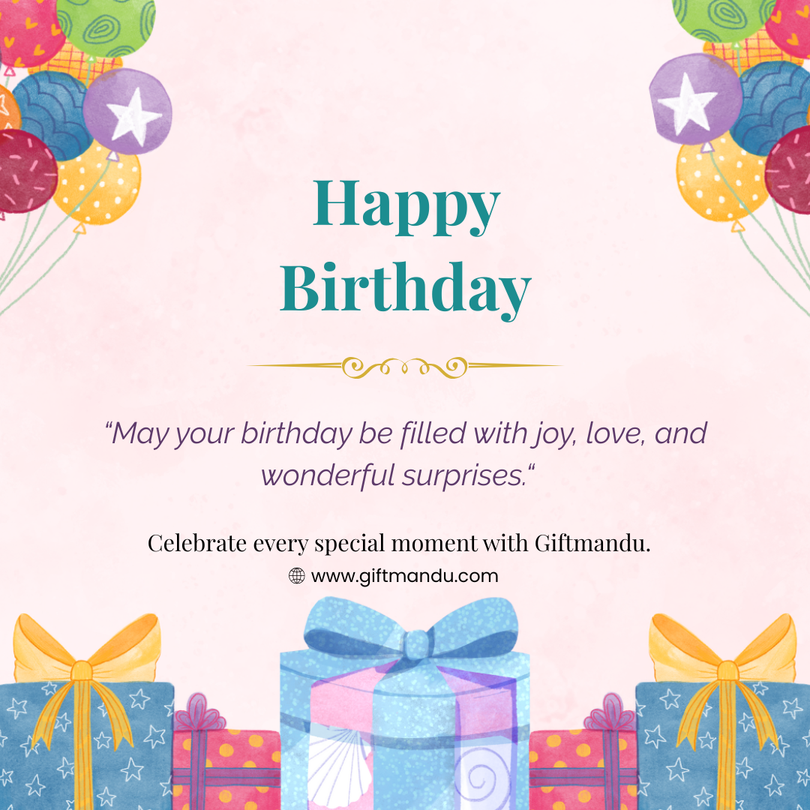

# Happy Birthday Card (Canva Project)

**Project Type:** Greeting Card  
**Tool Used:** Canva  
**Project Date:** May 2025

## About the Project
This is a colorful and fun **birthday card** made using Canva.  
It was designed to share with friends, customers, or as part of a company’s customer appreciation post.

I used playful fonts and bright colors to make it look joyful and festive.

##  Goal
To create a cheerful birthday message that looks good both as a print card and as a digital post.

## Message Example
*"Wishing you joy, laughter, and lots of cake!"*

## 📸 Preview

> I created this to practice layout, text placement, and festive design for social media and branding.

